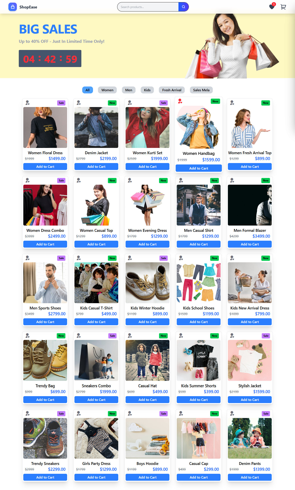

## React E-Commerce With maximum use useState

Project  – React E-Commerce Application

##  🛠️ Tech Stack
 
 -  Frontend

 -  React (Functional Components)
 -  React Hooks: useState, useEffect
 -  Tailwind CSS (Utility-first styling)
 -  Remix Icon (Icon library)
 -  State & Logic
 -  JavaScript ES6+
 -  Array methods: map, filter, reduce, some
 -  Conditional rendering and controlled components
 -  Tooling
 -  Vite (Fast development environment)
 -  PostCSS
 -  npm package manager

##   📚 Lessons Learned

 -  Proper state design prevents unnecessary bugs and UI conflicts
 -  React props are case-sensitive and must be passed carefully
 -  Hooks like useNavigate require proper context (Router)
 -  Conditional rendering should avoid mixed logical operators
 -  Always verify which variable is in scope inside .map() loops
 -  Functional updates are safer when updating state based on previous values
 -  Never render UI values directly without validating state existence
 -  Centralized UI state simplifies complex panel management
 -  JavaScript logic quality directly affects React UI stability
 -  Debugging errors strengthens understanding of React’s render cycle

 -  This project is a fully responsive e-commerce web application built using React and Tailwind CSS.
  -  The application heavily relies on useState for managing UI and application state.
Product data, cart items, wishlist items, and UI panels are all controlled using React state.
  -  useEffect is used to synchroniz  -  e state changes with side effects such as UI updates and calculations.
  -  Cart functionality includes adding, removing, and updating product quantities.
Wishlist logic is implemented with conditional rendering and state-based toggling.
The cart and wishlist badges only render when item count is greater than zero.
A single activePanel state controls Cart, Wishlist, and Order panels to avoid UI conflicts.
  -  Functional state updates are used to prevent stale state bugs during add/remove operations.
  -  JavaScript array methods like map, filter, and some are used extensively for logic building.
  -  Conditional rendering is applied correctly using ternary operators instead of mixed logical operators.
  -  React Router is integrated for navigation, ensuring hooks like useNavigate work correctly.
  -  Remix Icon library is used for consistent and scalable UI icons.
  -  Tailwind CSS handles responsive layouts, animations, and transitions across devices.
  -  Mobile responsiveness is achieved using conditional components and state-driven menus.
  -  Error handling includes fixing undefined state access and reference errors.
  -  UI feedback such as animations and badge updates is fully state-driven.
  -  The project follows component-based architecture for reusability and clarity.
  -  All business logic is separated cleanly from UI rendering logic.
  -  This project significantly strengthened understanding of React hooks, JavaScript   -  logic, and real-world debugging.

 - User Action → Products.jsx (click AddToCart) 
   └──> Home.jsx cart state updated
         ├──> Cart.jsx (reads cart state → renders drawer)
         └──> LocalStorage updated automatically via useEffect

 - User Action → WishList.jsx (click AddToCart)
   └──> Home.jsx cart state updated
         └──> Cart.jsx re-render

 - User Action → WishList.jsx (click Remove)
   └──> Home.jsx wishList state updated
         └──> WishList.jsx re-render

 - Page Reload
   └──> Home.jsx loads cart & wishList from LocalStorage

    

<!-- 
 Use item — the current product in the .map() iteration , Wrap in an arrow function () => addToCart(item) so that it passes the product on click 

 <button
  onClick={() => addToCart(item)}
  className="mt-4 w-full bg-blue-500 text-white py-2 rounded-md hover:bg-blue-600 transition-colors duration-300">
  Add to Cart
</button>

then render automatically  

<h2>{product.name}</h2>
 -->

